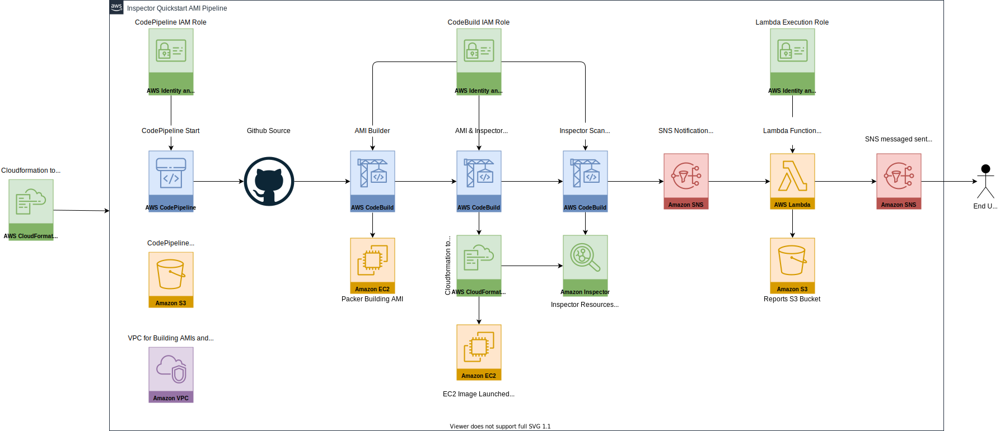

# aws-inspector-quickstart
aws-inspector-quickstart

## Required Prerequisites:

### Forking Repository:
You will need to create a fork of the repository below:
- Repo URL: https://github.com/stelligent/aws-inspector-quickstart

### Creating Github Access Token:
- Create a github access token to use for the parameter `GitHubToken` in the `aws-inspector-pipeline.yaml` template file.

### Creating EC2 keypair:
- Create an EC2 keypair in the region you’re planning to launch the pipeline template in
- The name of the EC2 keypair needs to be used in the parameter `KeyPair` of the `aws-inspector-pipeline.yaml` template file.

### Repository Parameters:
All parameters are located in the `aws-inspector-pipeline.yaml`
- Set the `RepositoryOwner` parameter to the owner of the github account that the repository has been forked to.
- Set the `RepositoryName` parameter to the repository name
- Set the `BranchName` parameter to the branch you’re going to run the pipeline against if you aren’t going to use the master branch.

## Optional Prerequisites:
- Inspector scan duration can be set by updating the value for the parameter `ScanLength` in the `aws-inspector-pipeline.yaml`.  
- The unit of time is in seconds.  The default value is set to 3 minutes. 

## Acceptance Test:
Steps to run `verify_resources.py`

1. Configure a default AWS profile or the AWS environment variables on the machine intended to run the script
2. Have Python 3 installed on the machine intended to run the script
3. Install the dependencies listed in the `requirements.txt` file from the repository
4. Provide the name of the Inspector Pipeline Cloudformation stack as a command line argument

The test will call the AWS api using boto3 and print the CodePipeline name, Lambda function name, S3 reports bucket name and the ARN of the SNS topic used to notify the user when new scans complete.

## Architecture Diagram
